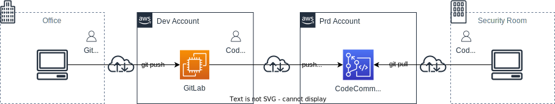

# Mirror from gitlab to codecommit

個人情報等をあつかうセキュリティが厳しいシステムの場合、本番環境へのアクセスを物理的に隔離された場所からのみに制限することがあります。この隔離環境はネットワーク的にもインバウンド/アウトバウンドの制限がされています。これにより隔離環境からデータを持ち出すことを難しくしています。同時に隔離環境へデータを持ち運ぶのも手間がかかります。

IaCでシステムを運用する場合、コードを隔離環境に連携する必要があります。多くの場合、IaCのコードはGitで管理されているはずです。隔離環境でなければ端末からGitリポジトリをpullすればよいですが、隔離環境の端末から普段開発に使っているGitリポジトリに直接アクセスできてしまうと問題もあります。たとえば隔離環境の端末からpullしかできないユーザーを使い運用していくことを考えます。一見問題ないように思えますが、Gitリポジトリに直接アクセスできるため、pushもできるユーザーに切り替えてしまえば隔離環境からデータを持ち出せてしまいます。このように、データを持ち出せてしまう仕組みは隔離環境に好ましくありません。

そこで隔離環境からのデータ持ち出しを制限しつつ、Gitリポジトリのコードを安全に隔離環境へ連携する仕組みを紹介します。この仕組みは隔離環境へデータを送ることはできますが、隔離環境からデータを持ち出せません。操作もgit pushまたはgit pullだけで簡単です。

なお、今回紹介する方法はAWSを前提としています。

# 全体像

AWSは開発用アカウントと本番用アカウントの2つあります。開発環境にはコードを管理するGitリポジトリをセルフホストGitLabで立てます。このGitLabに対するインバウンドは作業端末のみを許可します。本番環境にはCodeCommitを作成します。CodeCommitにアクセスする専用のIAMユーザーを作成します。IAMユーザーはpush用とpull用の2種類を作成します。開発環境のGitLabから本番環境のCodeCommitへリポジトリのミラーリングを行います。ミラーはpush用ユーザーを使用して行います。最後に、隔離環境の端末からpull用ユーザーで本番環境のCodeCommitをpullします。



このように、この仕組みの肝は開発用のGitリポジトリと隔離環境用のGitリポジトリを別々で作成し、リポジトリのミラーリングで連携する点です。今回は セフルホストGitLab -> CodeCommit で連携させましたが他のGitリポジトリの組み合わせでも似たようなことはできると思います。

## 作業端末

普段の開発で使用する端末です。開発用のGitLabにもアクセスできます。本番環境のCodeCommitにはアクセスできません。

## GitLab

普段の開発で使用するGitLabです。コードの管理はこのGitLabで行います。このGitLabはインバウンドおよびアウトバウンドの通信を行います。

インバウンドの通信は普段の開発で行うGitの操作です。そのため、SecurityGroupのインバウンドは作業端末からのIPアドレスのみを許可します。

アウトバウンドはリポジトリのミラーで使用します。ミラーはインターネットのCodeCommitエンドポイントに通信します。インターネットへのアウトバウンドを絞りたい場合、GitLabにプロキシの設定を行いフォワードプロキシを経由させます。プロキシを使う場合は最後の方で解説します。

隔離環境へ連携したいリポジトリにはリポジトリのミラー設定を行います。ミラーには本番環境のCodeCommit URLとpush用ユーザーの認証情報を使って設定します。

## CodeCommit

本番環境にCodeCommitのリポジトリを作成します。また、CodeCommitにアクセスする専用のIAMユーザーも作成します。IAMユーザーはpush用とpull用の2つ作成します。push用のユーザーにはGitLabからリポジトリをミラーするのに必要な権限を与え、アクセス元のソースIPを開発環境のNAT Gatewayに限定します。これでCodeCommitへのpushは開発環境からのみ可能となり、本番環境および隔離環境からはpushできません。pull用のユーザーはpullに必要な権限を与え、アクセス元のソースIPを隔離環境の端末に限定します。

## 隔離環境端末

本番作業で使用する端末です。この環境の端末はプロキシ等でアクセスできる外部接続先が制限されています。開発用のGitLabには直接アクセスできません。

# Terraform

本リポジトリには以下のコード群を含みます。

- dev
  - VPC  (VPC、サブネット、インターネットゲートウェイ、NATゲートウェイを作成します。)
  - GitLab  (セルフホストのGitLabを作成します。)
- prd
  - CodeCommit  (リポジトリ、IAMユーザー(push用/pull用)を作成します。)

説明や注意事項は各モジュール配下のREDME.mdを確認してください。各モジュールの`versions.tf`は以下のように設定しています。自身の環境に合わせてタグ等は修正してください。

```
provider "aws" {
  region = "ap-northeast-1"
  default_tags {
    tags = {
      pj    = "mirror"
      env   = "dev"
      owner = "mori"
    }
  }
}
```

以下の順で構築します。3と4はフォワードプロキシを設定する場合のみ実施します。

## 1. terraform実行

以下のterraformを実行してください。自身の環境に合わせてterraform.tfvarsを修正してください。既存のリソースを使用する場合は実行しなくても良いです。devのコードは開発環境で、prdのコードは本番環境で実行してください。

- dev/vpc
- dev/gitlab
- prd/codecommit

## 2. CodeCommitユーザーの認証情報

CodeCommitモジュールで本番環境にIAMユーザーを作成した後、マネジメントコンソールでCodeCommitのHTTPS接続用のGit認証を作成します。やり方はAWSドキュメントの[Git 認証情報を使用した HTTPS ユーザーのセットアップ](https://docs.aws.amazon.com/ja_jp/codecommit/latest/userguide/setting-up-gc.html#setting-up-gc-iam)またはGitLabのドキュメントの[Set up a push mirror from GitLab to AWS CodeCommit](https://docs.gitlab.com/ee/user/project/repository/mirror/push.html#set-up-a-push-mirror-from-gitlab-to-aws-codecommit)にあります。作成した各ユーザーのUsernameとPasswordは控えておきます。

また、CodeCommitのHTTPSのクローンURLも控えておきます。

## 3. GitLabのリポジトリでミラー設定

開発環境のGitLabのリポジトリでミラーを設定します。公式の設定方法は[Set up a push mirror from GitLab to AWS CodeCommit](https://docs.gitlab.com/ee/user/project/repository/mirror/push.html#set-up-a-push-mirror-from-gitlab-to-aws-codecommit)にあります。

1. セルフホストGitLabのパブリックDNS名を使って作業端末からブラウザでアクセスします。アクセスはhttpを使用します。

2. ログイン画面で**username**はroot、**password**はEC2インスタンスのインスタンスIDを入力してログインします。

3. **New Project**からミラー対象のプロジェクト(リポジトリ)を作成します。作成するプロジェクト名は本番環境に作成したCodeCommitのリポジトリ名と同じ名前にします。例としてtest-repoという名前のプロジェクト(リポジトリ)作成します。

4. ミラー対象リポジトリで`Settings`->`Repository`->`Mirroring repositories`を開きます。

5. Git repository URLの入力ボックスにてCodeCommitのクローン用URL入力します。  
`https://mirror-prd-codecommit_access_user-at-456247553902@git-codecommit.ap-northeast-1.amazonaws.com/v1/repos/test-repo`  
のような形式で入力します。＠の前の部分は作成したCodeCommitモジュールで作成したpush用ユーザーのGit認証用のユーザー名を使っています。  

6. **Mirror direction**はPush、**Authentication method**はPasswordのままにします。

7. **Password**はpush用ユーザーのGit認証用のパスワードを使います。

8. `Mirror repository`で設定を反映します。

9. 追加するとMirrored repositoriesに追加されます。右はしのリロードマークを押すとミラーリングを手動で実行できます。**Last update attempt**と**Last successful update**が両方ともjust nowになれば問題なくミラーできています。

10. 上記をリポジトリ毎に実施します。  

## 4. 隔離端末からCodeCommitをクローン

隔離環境の端末からCodeCommitのリポジトリをクローンします。マネジメントコンソール等でCodeCommitのHTTPSクローンURLを確認しクローンします。ユーザーとパスワードは本番環境で作成したpull用ユーザーの認証情報を指定します。

## 5. 動作確認

1. 作業端末に開発環境のGitLabからリポジトリをクローンします。認証情報はGitLabのユーザー(とくに作成してなければroot)を使用します。

``` sh
$ git clone http://ec2-3-109-224-199.ap-south-1.compute.amazonaws.com/gitlab-instance-ece16e7e/test-repo.git
Cloning into 'test-repo'...
Username for 'http://ec2-3-109-224-199.ap-south-1.compute.amazonaws.com': root
Password for 'http://root@ec2-3-109-224-199.ap-south-1.compute.amazonaws.com': <instance id>
```

2. 修正を加えてpushします。

``` sh
$ cd test-repo
$ echo "mirror test" > mirror-test
$ git add .
$ git commit -m "mirror test"
$ git push
```

3. 隔離端末から本番環境のCodeCommitをpullし、変更が反映されていることを確認します。

``` sh
$ cd test-repo
$ git pull
$ ll
total 24
-rw-r--r--  1 moriryota  staff  6308  8 31 16:44 README.md
-rw-r--r--  1 moriryota  staff    12  8 31 16:57 mirror-test
```

4. 隔離端末からpushしようとしてもできません。

``` sh
$ echo "push test" > push-test
$ git add .
$ git commit -m "push test"
$ git push
fatal: unable to access 'https://git-codecommit.ap-northeast-1.amazonaws.com/v1/repos/test-repo/': The requested URL returned error: 403
```

# (参考) フォワードプロキシの使用

GitLabからのアウトバウンドを絞りたい場合、フォワードプロキシを立ててアウトバウンドを制限します。URLはホワイトリストで許可します。ミラーに必要なのはCodeCommitのエンドポイントであるため、`.amazonaws.com`などを許可すれば良いです。なお、フォワードプロキシを使う場合、GitLabからCodeCommitへ接続する経路は GitLab -> フォワードプロキシ -> NAT Gateway -> CodeCommit となります。そのため、本番環境で作成するpush用ユーザーのソースIPはNAT GatewayのIPアドレスで指定します。

## 1. フォワードプロキシ作成

開発環境のGitLabからインターネットへ出る前段にプロキシを立てます。AWSにフォワードプロキシを作成する方法は多々ありますが、私の環境にはEKSがあるためEKS Fargateでフォワードプロキシを構築します。やり方はこちらの[moriryota62/squid-on-eks](https://github.com/moriryota62/squid-on-eks)を参照ください。

## 2. GitLabにプロキシ設定

開発環境のGitLabにフォワードプロキシを設定する方法はこちらの[Setting custom environment variables](https://docs.gitlab.com/omnibus/settings/environment-variables.html)が参考になります。ミラーの場合、gitalyにプロキシを設定します。
セッションマネージャ等でセルフホストGitLabに入り、以下の様に/etc/gitlab/gitlab.rbを設定します。http_proxyおよびhttps_proxyの指定先はフォワードプロキシの公開アドレスです。

```
gitaly['env'] = {
    "http_proxy" => "http://k8s-kubesyst-squid-f7f22160e9-214904599b63299c.elb.ap-northeast-1.amazonaws.com:3128",
    "https_proxy" => "http://k8s-kubesyst-squid-f7f22160e9-214904599b63299c.elb.ap-northeast-1.amazonaws.com:3128"
}
```

設定したらGitLabを再構成します。一応、GitLabを停止して再度起動します。

```
gitlab-ctl stop
gitlab-ctl reconfigure
gitlab-ctl start
```